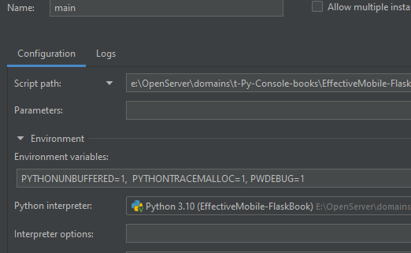

# Библиотека
## Примечание ("прочитать перед употреблением")
Учитывая, что это лишь тест. Цель теста оценить опыт претендента на должность\
внёс изменение в задачу. 

*"- Реализовать хранение данных в текстовом или json формате"* \
Приложение имеет полноценную базу данных (БД).\
Работа происходит с теми же словарями/json, в некотором роде.
Но, логика самой базы данных сложнее чем просто json который даже в \
файл не записывается (на прямую это не сказано, уточнять нет где).

Понимаю, что может затруднить проверку, тем более без Docker, терять \
всё равно нечего.

### База данных
Сама БД:
- написана на `sqlalchemy`;
- создавалась на момент разработки в `postgraSQL`.

Первичный и каждые последующие запуски автоматически запускают \
файл `project/models.py`. Проверка на наличие базы и таблиц в теле логики. \
Сама связь c `postgreSQL` реализована через `project/postcresbase.py`.

Вам достаточно лишь переписать соедениение под свой тип БД в строках\
```text
connection = psycopg2.connect(
        user=f"{APP_POSTGRES_LOGIN}",
        password=f"{APP_POSTGRES_PASS}",
        host=f"{APP_POSTGRES_HOST}",
        port=f"{APP_POSTGRES_PORT}",
    )
```
из файла `project/postcresbase.py`.

Всё остальное через `sqlalchemy`.

## Описание
Запуская приложение, в консоли, на выбор 6 команд.\
Выбирая команду вводим только цифры, а далее по следующей инструкции которая \
всплывает за каждым предыдущим действием. 

**Характеристика книг (в приложении) имеет**:
- Имя книги (от 5 символов, уникальное имя, тип строка); 
- Автор книги (тип строка);
- Год издания (4 символа, тип строка или число);
- Статус принимает лишь "в наличии" или "выдана".

### Меню сайта включает
0) Выход.
1) "Добавить книгу" включает в себя все выше упомянутые свойства \
книги, заполняя шаг, за шагом.
2) "Удалить книгу" вводим ID книги для удаления.
3) "Искать книгу" вводим название автора или год для поиска.
4) "Показать все книги" достаточно определиться с командой и результат.
5) "Изменить статус книги" вводим ID книги для изменения статуса, \
затем водим новый статус (в наличии/выдана).

## Stack
```text
[tool.poetry.dependencies]
python = "^3.10"
python-dotenv = "^1.0.1"
pytest-cov = "^6.0.0"
pytest-asyncio = "^0.24.0"

[tool.poetry.group.dev.dependencies]
asyncio = "^3.4.3"
autohooks = "^24.2.0"
flake8 = "^7.1.1"
pre-commit = "^3.8.0"
django-bootstrap4 = "^24.4"
markdown = "^3.7"
pylint = "^3.3.1"
isort = "^5.13.2"
black = "^24.8.0"
psycopg2 = "2.9.10"
sqlalchemy = "2.0.36"
pytest = "^8.3.3"
```
Тестирование через:\ 
```text
pytest
# и
from io import StringIO
from unittest.mock import patch
```


## .env
```text
APP_POSTGRES_HOST=localhost
APP_POSTGRES_PORT=5432
APP_POSTGRES_PASS=< password_for_your_db >
APP_POSTGRES_LOGIN=< login_for_your_db >
APP_POSTGRES_DBNAME=< dbname_for_your_db >
```
## Команды
Вы знаете , что такое `pip` & `poetry` и умеете их устанавливать.

### Установка зависимостей
```text
poetry install
# or
pip install requirements.txt
```

### Старт теста
```text
pytest --maxfail=1 --tb=auto --console_output_style=classic
```

### Старт приложения
```text
python main.py
```

#### Для работы через PyCharm

```text
Env. Var.: PYTHONUNBUFFERED=1,  PYTHONTRACEMALLOC=1, PWDEBUG=1,
Parameters: pytest --maxfail=1 --tb=auto --console_output_style=classic
```


## JSON
Файл `__tests__/test_main/moks.py` где в теле логики и заложена работа с JSON.\
Но сама заглушка не потребовалась , так как работу с БД тоже надо протестировать.